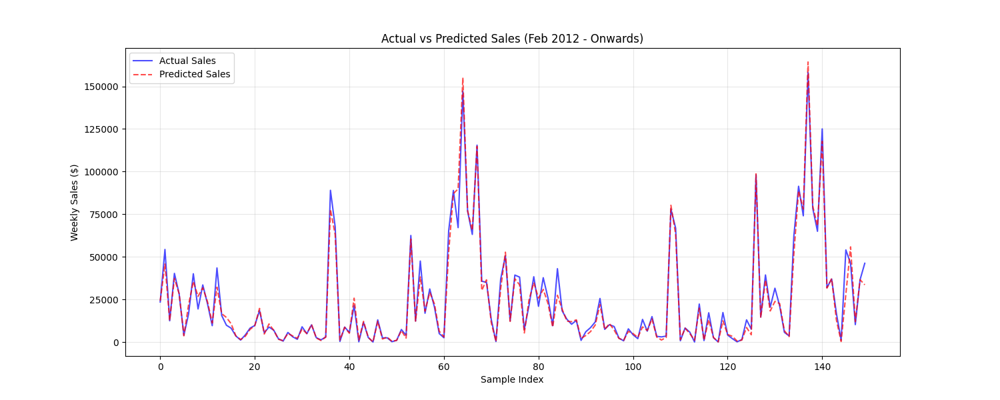

# Industrial Engineer to Data Science Journey 🚀

This repository documents my intensive bootcamp journey transitioning from **Industrial Engineering** to **Data Science**. It contains coding exercises, algorithms implemented from scratch, and mini-projects focusing on the mathematical foundations of Machine Learning.

## 📂 Repository Structure

### 1. Pandas & Data Analysis (`/01_Pandas_Data_Analysis`)
**Objective:** Transitioning from spreadsheet-based logic to Pythonic data manipulation and vectorization.

- **`01_basic_production_metrics.py`**: 
  - Introduction to Pandas DataFrame structure.
  - Basic KPI calculation and manual data entry simulation.
- **`02_shift_performance_analysis.py`**: 
  - Loading external data (`.csv`) and handling file paths dynamically.
  - Comparative analysis of shift performance (Day vs. Night) using GroupBy.
- **`03_time_series_production_trends.py`**: 
  - Handling `Datetime` objects for time-series analysis.
  - Trend visualization and identifying top defect days using sorting algorithms.
- **`04_automated_production_report.py`**: 
  - **Automation:** Creating reusable functions to generate standardized reports for different factories.
  - demonstratiing modular coding practices.

### 2. Regression Models (`/02_Regression_Models`)
**Objective:** Mastering predictive analytics using Linear and Non-Linear algorithms.

- **`01_simple_linear_regression.py`**:
  - **Single Variable Analysis:** Predicting costs based on production volume.
  - **Machine Efficiency:** Analyzing depreciation trends (negative slope).
- **`02_multiple_linear_regression.py`**:
  - **Multivariable Analysis (Clean Room Case):** Predicting energy bills based on 3 variables (Production, Temperature, Machines).
  - Visualization of "Actual vs. Predicted" values to assess model performance.
- **`03_regression_model_evaluation.py`**:
  - **Model Validation:** Implementing Train-Test Split to prevent overfitting.
  - **Metrics:** Calculating MAE (Mean Absolute Error) and R² Score.
- **`04_decision_tree_regressor.py`**:
  - **Non-Linear Modeling:** Using Decision Trees for complex, rule-based datasets.
  - Visualizing the decision logic (Tree Diagram).

### 3. Classification Models (`/03_Classification_Models`)
- **Focus:** Predicting binary outcomes (0/1) using Logistic Regression.
- **Projects:**
  - **E-Commerce Purchase Prediction:** Analyzing customer behavior (Age, Duration) to predict purchase probability.
  - **Confusion Matrix Analysis:** Understanding the business cost of False Positives vs. False Negatives.

### 4. Capstone Project: Walmart Sales Forecasting (`/04_Capstone_Walmart_Sales`)
**Objective:** Applying end-to-end Data Science pipeline skills to solve a real-world inventory and demand planning problem.

- **`01_data_loading_and_merging.py`**:
  - **Data Engineering:** Merging relational databases (Stores, Features, Sales) and validating `1:m` relationships.
  - **Integrity Checks:** verifying data consistency (e.g., Holiday flags) across different sources.
- **`02_data_cleaning.py`**:
  - **Preprocessing:** Handling missing values in promotional markdown data.
  - **Logic Correction:** Filtering out negative sales records (returns/errors) to ensure data quality.
  - **Feature Engineering:** Decomposing dates into Year, Month, and Week for time-series modeling.
- **`03_eda_visuals.py`**:
  - **Exploratory Analysis:** Visualizing weekly sales trends to identify seasonality (Christmas/Thanksgiving spikes).
  - **Hypothesis Testing:** Using Box Plots to statistically compare the impact of holidays on sales performance.
- **`04_feature_engineering.py`**:
  - **Time-Series Logic:** Creating "Lag Features" (Sales from 1 week ago, 1 year ago) to teach the model historical patterns.
  - **Trend Smoothing:** Implementing Rolling Mean (Moving Average) to capture medium-term trends and reduce noise.
  - **Event Modeling:** Designing mathematical countdowns ("Weeks to Christmas/Black Friday") to predict demand surges accurately.
- **`05_train_model.py`**:
  - **Validation Strategy:** Implementing a **Time-Based Split** (Train on 2010-2012, Test on 2012-Oct) instead of random shuffling to prevent data leakage.
  - **Machine Learning:** Training a **Random Forest Regressor** to handle non-linear relationships in sales data.
  - **Evaluation:** Measuring performance using MAE and R² Score, and generating a prediction vs. actual visualization.
  - **`app.py`**:
  - **Model Deployment:** Operationalizing the Random Forest model using **Flask** to create a REST API.
  - **Serialization:** Implementing `joblib` to load the pre-trained model (`.pkl`) and serve real-time predictions without retraining.
  - **Error Handling:** robust input validation to ensure feature alignment between user input and model requirements.
- **`test_api.py`**:
  - **Client Simulation:** Simulating a real-world client request (e.g., Store Manager input) to validate the API's response.
  - **Integration Testing:** Sending JSON payloads via `requests` library to verify the end-to-end prediction pipeline.

### 📊 Model Performance & Business Impact
After training the Random Forest model, the system was tested on unseen data (Feb 2012 - Oct 2012) to simulate real-world forecasting.

- **Accuracy (R² Score):** **96%**
- **Mean Absolute Error (MAE):** ~$1.89
- **Key Insight:** The model successfully captured high-variance events like **Christmas** and **Black Friday** thanks to the engineered `Countdown` features.

**Top Drivers of Sales (Feature Importance):**
1. **Department:** Different product categories have distinct sales baselines.
2. **Lag_1 (Last Week's Sales):** Short-term momentum is a strong predictor.
3. **Moving Average (MA4):** Monthly trend stability is crucial.
4. **Size:** Store capacity directly correlates with volume.

### 🚀 Future Improvements
- **Hyperparameter Tuning:** Implementing GridSearchCV to optimize Random Forest parameters.
- **Easter Effect:** Adding a dynamic countdown for Easter (which changes dates yearly) to fix minor seasonal drifts.
- **Cloud Hosting:** Deploying the Flask API to a cloud provider like AWS or Heroku for global access.

---

## 🛠 Tools & Technologies
- **Language:** Python 3.x
- **Libraries:** Pandas, NumPy, Scikit-Learn, Matplotlib, Seaborn, Flask, Requests, Joblib
- **Environment:** VS Code

## 📢 Note on Datasets
Since the primary goal of this repository is to understand the **logic and mathematics** behind algorithms, simple and synthetic datasets (Small Data) are used intentionally. Real-world "Big Data" projects and Cloud deployments will be added in future modules.

---
*Author: Merve Kenc*
